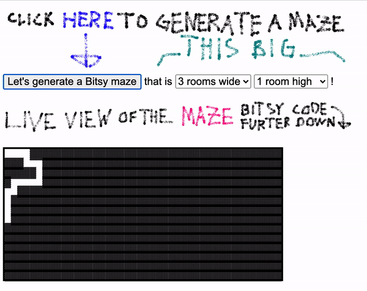
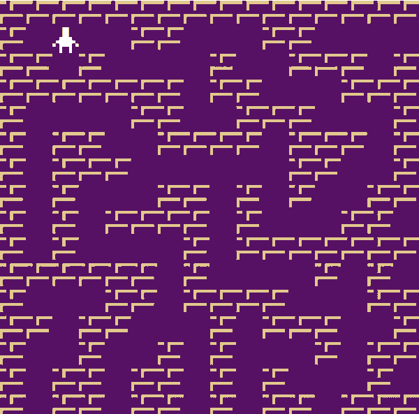

# A simple maze generator for Bitsy

This is a simple one-page web app that generates random mazes **and** code for the Bitsy game maker so that these mazes can be directly copy-n-pasted to Bitsy. Why? Maybe you want to have a maze as part of your game, then this gives you a place to start! Or maybe you just like to play autogenerated maze games. Try out the maze generator here: https://rabaath.itch.io/simple-maze-generator-for-bitsy

Here is an example of a 2x2 maze game generated by the maze generator: https://rabaath.itch.io/procedurally-generated-2x2-bitsy-maze

The maze generator uses a modified version of the Growing Tree algorithm which you can read more about here: http://weblog.jamisbuck.org/2011/1/27/maze-generation-growing-tree-algorithm.html